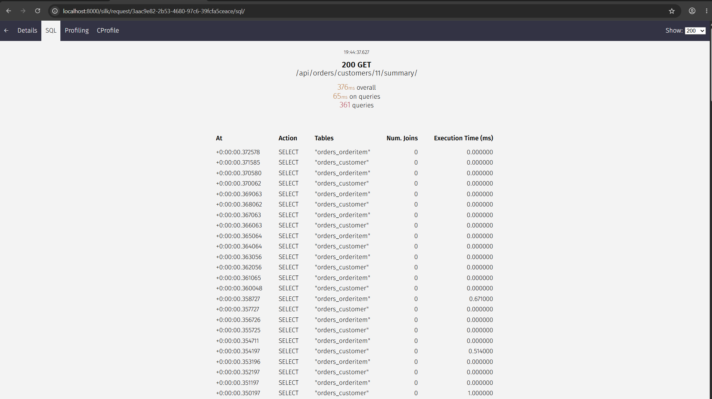
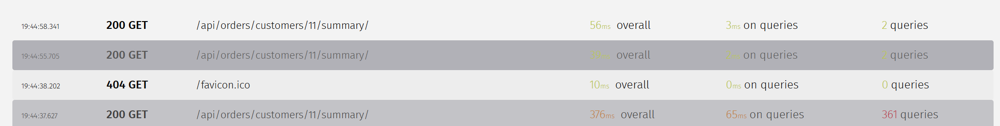
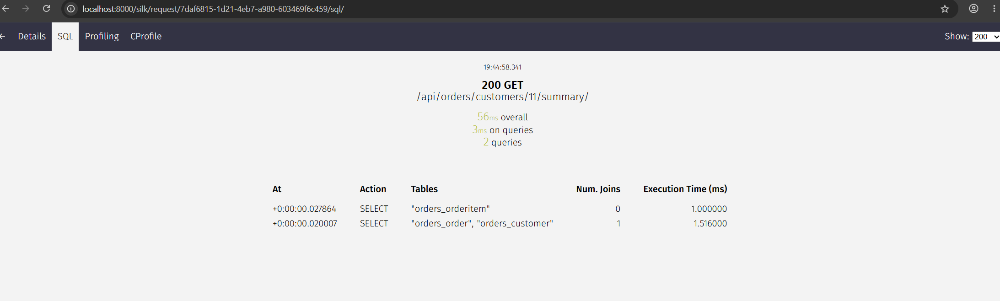

# Section 1 — Diagnose a Broken System

## Investigation Log

**1. Reproduced it first.**
Before guessing, I seeded real data (10 customers, 50-200 orders each, 2-4 items per order) and hit the dashboard endpoint for a customer with 180+ orders. Confirmed: fast for small customers, slow for the big ones. That already rules out "it's slow for everyone" causes like a bad migration or a global settings change, and points at something that scales with row count.

**2. Checked what actually changed in the deploy.**
Task says "no code change was made to that view." So I looked one level out: models, urls, settings, middleware. Nothing there either in this repo's case — so the realistic culprit in this kind of incident is a *related* change: a new field added to a serializer/response that touches a FK, a template that started looping over a related set, an admin list_display change, a new consumer of the same queryset. The regression doesn't have to be in the view function itself to make the view slow.

**3. Ran the profiler.**
Installed and wired up django-silk (already in INSTALLED_APPS/MIDDLEWARE). Hit the endpoint, opened Silk's SQL tab. This is the actual diagnostic step everything before this was forming a hypothesis, this is testing it.
Silk showed 362 queries for one request, for a customer with 180 orders. 

**5. Confirmed against the code.**
`customer_orders_summary` loops over `orders` and for each one does `order.customer.name` and `order.items.all()`. Neither `Order.objects.filter(...)` nor the loop tells the ORM to fetch those related rows up front, so Django fires a fresh query per order, per relation. 180 orders × 2 relations + 2 base queries = 362. Matches exactly.
The 2 base queries are: one to fetch the Customer object itself (for the summary header), and one to evaluate Order.objects.filter(customer_id=customer_id) when the for order in orders loop starts iterating.

## Root Cause

**Category: N+1 query, via missing `select_related` / `prefetch_related`.**

It was ORM issue
At 10-20 orders this is invisible (20-40 extra queries, each sub-millisecond on SQLite/small tables). At 200+ orders on a real Postgres instance with network round-trip per query, it's 400+ round trips that's the 30s timeout.

## The Problem, in Code

`orders/views.py` — `customer_orders_summary`, broken path (default, no `?fixed=1`):

```python
orders = Order.objects.filter(customer_id=customer_id)

rows = []
for order in orders:
    items = order.items.all()          # query #1 per order (OrderItem)
    rows.append({
        'order_id': order.id,
        'customer_name': order.customer.name,   # query #2 per order (Customer)
        'status': order.status,
        'item_count': len(items),
        'items_total': sum(i.quantity * i.unit_price for i in items),
    })
```

`order.customer` and `order.items.all()` are lazy — Django doesn't fetch them until accessed, and it fetches them one row at a time inside the loop.

## The Fix

Same view, `?fixed=1` path:

```python
orders = Order.objects.filter(customer_id=customer_id) \
    .select_related('customer') \
    .prefetch_related('items')
```

**Why this works at the DB/ORM level:**

- `select_related('customer')` — `Order.customer` is a ForeignKey, so Django does a SQL `JOIN` against `orders_customer` in the *same* query that fetches orders. One query, one round trip, `order.customer` is already populated in memory when you access it in the loop.
- `prefetch_related('items')` — `OrderItem` is a reverse FK (many `OrderItem` per `Order`), so a JOIN would multiply rows (one row per item, not per order). Instead Django runs a *second* query: `SELECT * FROM orders_orderitem WHERE order_id IN (<all order ids from the first query>)`, then matches items back to orders in Python. Still O(1) queries regardless of how many orders there are — just 2 queries total instead of 2×N.

Net result: 362 queries → ~3 queries (base order query, customer join folded in, one items prefetch query), independent of order count.

**One gotcha I hit while testing:** `select_related`/`prefetch_related` only pay off if you evaluate the queryset once, cleanly. I initially had `orders.exists()` and a `logger.info(msg, orders)` call before the loop — `.exists()` runs its own throwaway `SELECT 1 LIMIT 1` and passing the queryset into the logger forces an early, separate evaluation. Both of those consumed the queryset outside of the loop's iteration, so the prefetch cache wasn't what the loop ended up reading from. Fix: evaluate once with `list(orders)`, then loop over that list. Lesson — prefetching isn't just "add the method call," it depends on not touching the queryset in a way that forces a second, uncached evaluation.

## Profiler Evidence

**Before fix** (`/api/orders/customers/11/summary/`, customer with 180 orders):




362 queries, 309ms on queries, one SELECT per order per relation.

**After fix** (`/api/orders/customers/11/summary/?fixed=1`, same customer):



---

# Section 3 — Multi-Tenant Data Isolation

## Approach

`TenantManager.get_queryset()` filters by tenant on every call, so `.all()`, `.filter()`, `.get()`, `.count()` all go through it — no per-query filter to remember. Tenant is stored in a `contextvars.ContextVar`, set by middleware per request, reset in a `finally` block so it can't leak into the next request on the same worker. No tenant bound → manager raises `RuntimeError`, fails closed instead of returning an empty queryset.

Tests: `tenants/tests.py`. Proves tenant A can't read tenant B's row even by known pk, `.filter()`/`.count()`/`.exists()` stay scoped, and no-tenant-bound raises instead of silently returning nothing.

## Deliberate unscoped query

`TenantMiddleware._resolve_tenant()` calls `Tenant.objects.get(subdomain=...)` — this is unscoped by design. `Tenant` has no `TenantManager`; it's the thing that defines tenants, so it can't be scoped by a tenant that hasn't been resolved yet. Everything else in the app (`Order`, etc.) goes through `TenantManager` and stays scoped.

## Async failure mode

Thread-locals are keyed per OS thread. That's fine under WSGI (one thread per request), but breaks under ASGI/async views: a thread can run multiple concurrent requests interleaved at `await` points, since `await` yields the thread back to run other coroutines while waiting on I/O. A thread-local tenant value set by request A can get read by request B's coroutine resuming on the same thread — cross-tenant leak.

`contextvars.ContextVar` doesn't have this problem because asyncio copies context per `Task`, not per thread. Each coroutine gets its own isolated view of the var even when multiplexed onto the same OS thread. This is why `context.py` uses `contextvars` instead of `threading.local()` — it's correct under both WSGI and ASGI, so there's no reason to pick thread-local at all.
